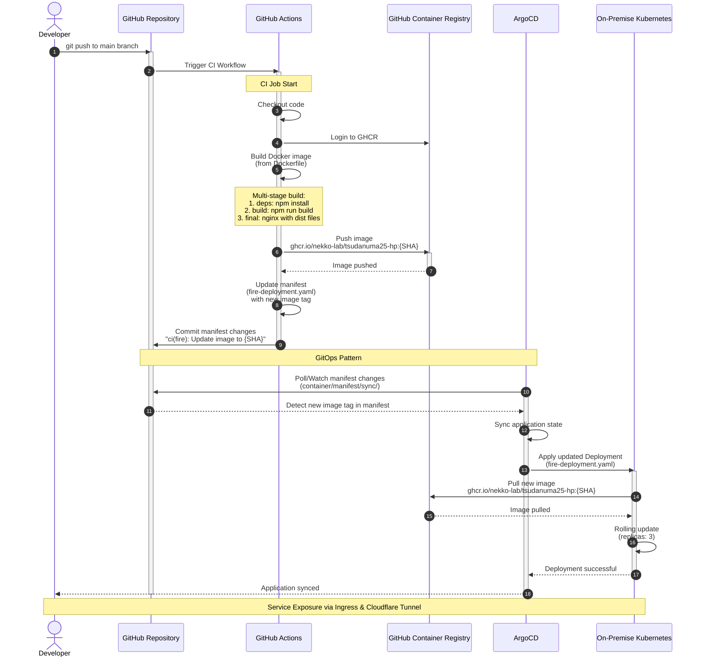

# Fire!〜Miku's Origin Live2025〜 in 第 76 回 津田沼祭 Web page

produced by Nekko Lab

### [Web page](https://numasai2025.nekko-lab.dev/)

## Start dev server

```shell
npm install
npm run dev
```

## Build server

```shell
npm run build
```

## Build image

```shell
docker build -f container/Dockerfile -t numa2025_fire .
```

## Run container

```shell
docker run -d -p 80:8080 numa2025_fire
```

## components



1. GitHub Actions CI パイプライン (自動化されたビルド・プッシュ)
開発者が main ブランチにプッシュ
GitHub Actions が自動トリガー
Docker イメージをビルド (マルチステージビルド: Node.js → Nginx)
GHCR (GitHub Container Registry) にプッシュ (ghcr.io/nekko-lab/tsudanuma25-hp:{SHA})
Kubernetes マニフェスト (fire-deployment.yaml) のイメージタグを自動更新
変更をコミット
2. ArgoCD による CD パイプライン (GitOps パターン)
ArgoCD がGitリポジトリの sync を監視
マニフェストの変更を検知
Kubernetesクラスタに自動デプロイ
ローリングアップデートでPodを更新 (レプリカ数: 3)
3. サービス公開
fire-svc がPodを公開
Ingress が numasai25.nekko-lab.dev でトラフィックをルーティング
Cloudflare Tunnel を使用して外部公開
このCI/CDパイプラインは、コードの変更から本番環境へのデプロイまでを完全に自動化し、GitOpsの原則に従ってインフラの状態をGitで管理しています。
